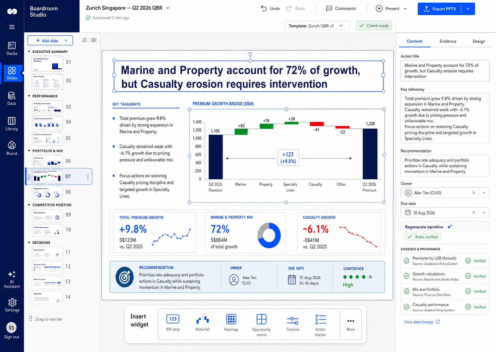
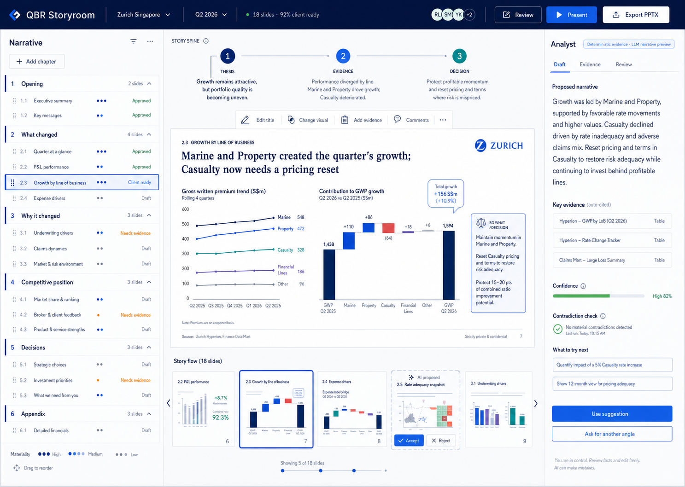
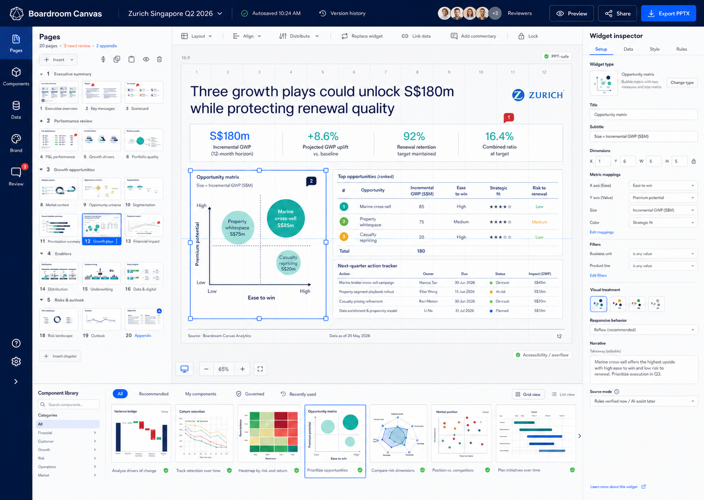

# QBR Studio Visual Design Blueprint

## Status

Design direction only. This document does not change the current runtime.

The three concept images were created to explore how Virtual Analyst can evolve
from a generated slide viewer into a client-ready QBR authoring product.

## Design Objective

Create an insurance QBR workspace that can:

- Produce a genuine executive narrative rather than a fixed sequence of pages.
- Support a variable number of slides selected by materiality and meeting need.
- Keep every page, narrative field, widget, and visual editable.
- Use deterministic evidence and commentary today.
- Introduce LLM-assisted narrative planning later without weakening governance.
- Keep the browser preview and editable PowerPoint output visually aligned.
- Produce a deck that is credible in a real carrier or client QBR.

The product should feel like a purpose-built consulting workspace, not a
dashboard with an Export button and not an unrestricted presentation editor.

---

## Concept Images

### Concept 1: Decksmith

Decksmith is the most familiar authoring model. It combines:

- A PowerPoint-like slide filmstrip.
- A large editable 16:9 canvas.
- A contextual content and design inspector.
- A governed widget insertion toolbar.
- Evidence and provenance directly beside editable commentary.

#### Strengths

- Immediately understandable to presentation users.
- Makes editability obvious.
- Strong direct manipulation of slide elements.
- Good fit for late-stage polishing and client-ready review.
- Easy mental model for adding, duplicating, hiding, and reordering slides.

#### Risks

- Can encourage users to format before the story is solid.
- A large deck may become difficult to reason about from thumbnails alone.
- Could drift toward a generic PowerPoint clone.
- Narrative quality may remain dependent on the user noticing story gaps.

#### Best Use

Use this interaction model for detailed slide editing and final deck polish.

---

### Concept 2: QBR Storyroom

Storyroom treats the QBR as an argument with a beginning, evidence, and a
decision. Its primary objects are chapters, claims, evidence, and decisions
rather than slide geometry.

#### Strengths

- Strongest model for building a coherent executive story.
- Makes variable slide count feel natural.
- Materiality, evidence readiness, and approval state are visible.
- Separates thesis, evidence, implication, and decision.
- Provides the right future location for LLM assistance.
- Encourages users to fix the story before polishing slides.

#### Risks

- Less familiar than a standard slide editor.
- Detailed formatting still requires a secondary editing surface.
- The analyst panel could become noisy if it behaves like generic chat.
- Suggestions must never silently change approved story content.

#### Best Use

Use this as the deck-level planning, sequencing, evidence review, and narrative
approval experience.

---

### Concept 3: Boardroom Canvas

Boardroom Canvas is a governed modular composition system. Users build pages
from reusable, data-bound, PowerPoint-safe widgets on a controlled grid.

#### Strengths

- Best support for advanced widgets.
- Strongest model for complete page editability.
- Clear separation of widget setup, data, style, and rules.
- Makes browser/PPT parity a visible product feature.
- Supports reusable templates without allowing layout chaos.
- Scales better than hardcoded slide layouts.

#### Risks

- Can feel technical or design-tool-like to business users.
- Too much freedom can weaken presentation consistency.
- A large component library requires governance and search.
- Grid and overflow rules must be exceptionally clear.

#### Best Use

Use this for page composition, widget configuration, data binding, design
governance, and reusable layout creation.

---

## Recommended Product Direction

The recommended experience is a hybrid of Concept 2 and Concept 3, with selected
interaction patterns from Concept 1.

### Recommended Combination

1. Use **Storyroom** as the default deck-level experience.
2. Use **Boardroom Canvas** when a user opens a page for detailed editing.
3. Use **Decksmith's filmstrip and direct editing cues** during final review.

The product therefore has three connected levels:

| Level | Primary purpose | Recommended interaction |
| --- | --- | --- |
| Deck | Shape the QBR argument | Storyroom |
| Page | Compose a client-ready slide | Boardroom Canvas |
| Element | Edit text, data, and visual treatment | Decksmith-style inspector |

This avoids forcing narrative planning, visual composition, and field editing
into one overloaded screen.

---

## Core Product Principles

### 1. Story Before Formatting

The product should first answer:

- What changed?
- Why does it matter?
- What evidence proves it?
- What decision or action follows?
- What does the client need to discuss?

Only after those questions are answered should detailed visual formatting become
the main task.

### 2. Variable, Materiality-Driven Decks

The deck should not have a permanently fixed number of pages.

Slide selection should depend on:

- Materiality of movement.
- Strategic relevance.
- Evidence quality.
- Audience.
- Meeting duration.
- Required decisions.
- Prior-QBR commitments.
- User-pinned content.

Sections without meaningful evidence should be omitted, moved to the appendix,
or shown as explicit data limitations.

### 3. Everything Editable, Evidence Preserved

Users should be able to edit presentation content without destroying the
generated source.

Every editable field should retain:

- Generated value.
- Current display value.
- Source type.
- Edit status.
- Editor.
- Edit timestamp.
- Optional reason.
- Reset capability.

### 4. Deterministic Today, LLM-Assisted Later

The initial product should describe its narrative source honestly:

- `Rules verified`
- `User edited`
- `AI suggested`
- `AI generated, awaiting approval`
- `Approved`

LLM assistance should be introduced as a suggestion layer, not an invisible
replacement for deterministic logic or approved user content.

### 5. Browser and PowerPoint Are Two Renderers of One Document

The application and PPT export should consume the same approved deck, page,
widget, content, and layout definitions.

PowerPoint export must not independently regenerate:

- Commentary.
- Page sequence.
- Widget choice.
- Data filters.
- User overrides.
- Titles.
- Recommendations.

### 6. Client-Ready Is a Governed State

`Client-ready` should mean the deck has passed defined checks, not merely that a
green badge was selected.

---

## Recommended Information Architecture

### Global Product Modes

- **Narrative** — chapters, story flow, materiality, and approvals.
- **Pages** — slide list, order, section grouping, hide/show, and appendix.
- **Canvas** — detailed page composition.
- **Components** — governed widget library.
- **Data** — filters, metrics, evidence, definitions, and lineage.
- **Brand** — approved theme, template, typography, colors, and footer.
- **Review** — comments, approvals, issues, and client-ready checks.
- **Export** — preview, selected pages, notes, appendix, and PPTX generation.

### Top Bar

The top bar should contain:

- Client and deck name.
- Reporting period.
- Report type.
- Autosave state.
- Version history.
- Current template.
- Client-ready status.
- Reviewer avatars.
- Review mode.
- Present.
- Export PPTX.

The top bar should remain quiet. Advanced controls belong in contextual panels.

---

## Narrative Workspace

### Chapter Structure

A mature insurance QBR can use the following default agenda:

1. Opening and executive thesis.
2. Quarter at a glance.
3. Premium and financial performance.
4. What changed.
5. Drivers of change.
6. Portfolio mix and quality.
7. Geographic and industry performance.
8. Share of wallet and market position.
9. Whitespace and growth opportunities.
10. Risks and outlook.
11. Prior-QBR commitments.
12. Decisions required.
13. Next-quarter actions.
14. Methodology and appendix.

The planner should include only chapters justified by the current evidence and
meeting purpose.

### Story Item States

Each chapter and slide should visibly show one state:

- Proposed.
- Draft.
- Needs evidence.
- Needs review.
- User edited.
- Approved.
- Client-ready.
- Appendix.
- Hidden.

### Story Spine

Every major finding should connect:

1. **Thesis** — the executive claim.
2. **Evidence** — the facts supporting it.
3. **Implication** — why it matters.
4. **Decision** — what must be decided.
5. **Action** — owner, date, impact, and success measure.

The UI should expose broken links. For example, a decision with no supporting
evidence should produce a review warning.

### Materiality

Materiality should not be represented by one unexplained score.

Useful dimensions include:

- Financial magnitude.
- Rate of change.
- Strategic relevance.
- Confidence.
- Client controllability.
- Risk severity.
- Decision urgency.

The UI can summarize these into a simple High, Medium, or Low marker while
allowing reviewers to inspect the reason.

---

## Page and Slide Management

### Required Page Actions

- Add from approved layout.
- Add blank governed page.
- Duplicate.
- Rename.
- Reorder.
- Move between chapters.
- Move to appendix.
- Hide from export.
- Lock.
- Delete.
- Restore.
- Add speaker notes.
- Assign reviewer.
- Mark approved.

### Slide Navigation

Support both:

- A chapter-oriented narrative outline.
- A thumbnail filmstrip for visual navigation.

Users should be able to switch between outline, compact list, and thumbnail
views without changing the document.

### Page Count

Display:

- Total pages.
- Main-deck pages.
- Appendix pages.
- Hidden pages.
- Pages needing review.

The product should never imply that 12, 18, or 20 pages is always correct.

---

## Editable Canvas

### Canvas Behavior

- Fixed 16:9 page frame.
- Governed 12-column grid.
- Snap-to-grid.
- Alignment guides.
- Resize handles.
- Distribute and align controls.
- Keyboard movement.
- Layer ordering where permitted.
- Locking.
- Grouping.
- Overflow boundaries.
- Safe zones for title, body, footer, and confidentiality text.

### Freedom With Guardrails

Business users should be able to:

- Reposition widgets within the approved grid.
- Resize within permitted ranges.
- Change compatible chart types.
- Edit content.
- Add or remove optional blocks.

Business users should not be able to:

- Break brand typography.
- Place objects outside export-safe bounds.
- Use inaccessible color combinations.
- Create unreadably small text.
- Remove mandatory confidentiality or source elements.
- Bind a widget to incompatible data.

### Context Toolbar

When a page element is selected, show only relevant actions:

- Edit title.
- Replace widget.
- Link data.
- Add evidence.
- Add commentary.
- Align.
- Distribute.
- Duplicate.
- Lock.
- Hide.
- Delete.

---

## Inspector Design

The right-side inspector should be stable across widget types.

### Inspector Tabs

#### Setup

- Widget type.
- Title.
- Subtitle.
- Layout role.
- Dimensions.
- Display density.
- Responsive/export behavior.

#### Data

- Dataset.
- Metric.
- Dimensions.
- Aggregation.
- Filters.
- Comparison period.
- Ranking or Top-N.
- Source artifact.
- Refresh state.
- Lineage.

#### Style

- Approved visual treatment.
- Compatible chart type.
- Label density.
- Legend behavior.
- Number format.
- Accent color.
- Annotation visibility.

#### Rules

- Inclusion criteria.
- Materiality threshold.
- Minimum sample size.
- Confidentiality behavior.
- Missing-data behavior.
- Export behavior.
- Narrative source.

#### Evidence

- Claims supported.
- Source rows or aggregate.
- Metric definition.
- Calculation method.
- Data freshness.
- Confidence.
- Contradiction status.

---

## Widget System

### Widget Categories

#### Executive

- Executive thesis.
- KPI band.
- Key messages.
- Decision required.
- Recommendation.
- Risk and watch item.
- Client ask.

#### Performance

- Actual versus target.
- Premium trend.
- Variance bridge.
- Rate-volume-mix bridge.
- Renewal and new-business bridge.
- Growth contribution.
- Ranking table.

#### Portfolio

- Mix shift.
- Portfolio heatmap.
- Product-country matrix.
- Concentration chart.
- Cohort retention.
- Segment performance.
- Geographic performance.

#### Competitive

- Market position.
- Share-of-wallet comparison.
- Peer benchmark.
- Rank gap.
- Broker or client feedback summary.
- Strength-versus-competitor matrix.

#### Opportunity

- Opportunity matrix.
- Whitespace heatmap.
- Growth pipeline.
- Scenario comparison.
- Opportunity ranking.
- Incremental premium bridge.

#### Risk

- Risk radar.
- Claims trend.
- Renewal-at-risk list.
- Exposure concentration.
- Risk register.
- Watch-list timeline.

#### Execution

- Decision table.
- Action tracker.
- Initiative roadmap.
- Milestone timeline.
- Owner and due-date matrix.
- Prior-QBR commitment tracker.

#### Appendix

- Detailed table.
- Methodology.
- Metric definitions.
- Data gaps.
- Source lineage.
- User overrides.

### Widget Quality Requirements

Every widget template should define:

- Intended analytical question.
- Supported data shapes.
- Required and optional fields.
- Compatible layouts.
- Minimum and maximum size.
- Browser renderer.
- PowerPoint renderer.
- Overflow behavior.
- Empty state.
- Loading state.
- Accessibility behavior.
- Source presentation.
- Editable properties.
- Locked brand properties.

---

## Slide Archetypes

The visual system should offer reusable archetypes rather than hardcoding every
individual slide.

### Recommended Archetypes

- Cover.
- Agenda.
- Section divider.
- Executive summary.
- Action-title plus one visual.
- Action-title plus two visuals.
- Key takeaway plus evidence panel.
- KPI band plus drivers.
- Full-page chart.
- Full-page table.
- Opportunity matrix plus ranked actions.
- Risk review.
- Decision required.
- Initiative tracker.
- Prior-QBR actions.
- Methodology and limitations.
- Appendix detail.

Each archetype should support optional regions without leaving awkward blank
space when a region is unused.

---

## Commentary and Narrative Editing

### Editable Narrative Fields

- Executive thesis.
- Action title.
- Slide question.
- Key takeaways.
- Implication.
- Recommendation.
- Decision required.
- Owner.
- Due date.
- Expected impact.
- Confidence.
- Speaker notes.

### Source Badge

Each narrative field should display its origin:

- Rules.
- User.
- AI suggestion.
- AI accepted.
- Imported.

### Regeneration Rules

Future LLM regeneration should:

- Operate on one selected field, slide, or chapter.
- Respect locked content.
- Preserve accepted user edits.
- Use only linked evidence.
- Show the proposed change before applying it.
- Explain which evidence influenced the proposal.
- Support accept, reject, and compare.
- Never rewrite the full deck unless explicitly requested.

### Useful Future AI Actions

- Sharpen the action title.
- Make the message more executive.
- Offer another evidence-backed angle.
- Compress for a five-minute version.
- Expand for a detailed review.
- Draft speaker notes.
- Identify missing evidence.
- Detect contradiction.
- Suggest a decision.
- Suggest appendix placement.

The AI panel should behave like a focused analyst assistant, not an open-ended
chat window occupying permanent space.

---

## Evidence and Governance

### Claim-to-Evidence Model

Every factual claim should link to:

- Metric definition.
- Dataset.
- Filters.
- Period.
- Aggregation.
- Comparison basis.
- Source artifact.
- Calculation result.
- Data freshness.

### Evidence States

- Verified.
- Partially supported.
- Stale.
- Conflicting.
- Missing.
- User supplied.

### Data Gaps

Missing data should:

- Never be replaced with generic commentary.
- Be visible during review.
- Prevent unsupported claims from reaching client-ready state.
- Be included in methodology where material.
- Offer a clear next step for resolution.

### User Overrides

Manual edits must be visible and auditable. The system should distinguish:

- Narrative-only wording changes.
- Display-value corrections.
- Source-data corrections.
- Layout changes.
- Approval decisions.

---

## Visual Design System

### Design Character

The visual language should feel:

- Executive.
- Analytical.
- Calm.
- Precise.
- Trustworthy.
- Client-ready.
- Insurance-specific.

It should not feel:

- Playful.
- Consumer-oriented.
- Decorative.
- AI-themed.
- Like a collection of unrelated cards.
- Like a generic BI dashboard.

### Color Direction

- Primary navy: `#000F47`
- Primary blue: `#0B4BFF`
- Cyan accent: used sparingly for information emphasis.
- White: primary slide surface.
- Cool gray: authoring workspace and secondary surfaces.
- Green: positive or verified.
- Amber: warning, incomplete, or needs evidence.
- Red: negative movement, conflict, or blocked.

Status color should never be the only way information is communicated.

### Typography

- Use a compact enterprise sans-serif for the product UI.
- Use approved client/template fonts for the slide itself.
- Slide titles should be action-oriented sentences.
- Body text should remain readable when exported.
- Avoid small text used merely to fit excessive content.
- Limit the number of typography levels on a slide.

### Layout

- Prefer alignment, spacing, and hierarchy over nested containers.
- Avoid putting every section in a rounded card.
- Use dividers and surface tint only when needed.
- Keep tool panels dense but the slide canvas visually quiet.
- Let the client slide remain the visual focal point.

### Iconography

- Use a consistent professional icon set.
- Use icons to identify actions and states, not as decoration.
- Avoid emoji and novelty AI symbols.
- A small sparkle may identify AI assistance, but should not dominate.

---

## Client-Ready Review

### Client-Ready Checklist

A deck can be marked client-ready only when:

- Required chapters are approved.
- All main-deck factual claims have evidence.
- No material contradiction remains unresolved.
- No export overflow exists.
- Minimum font sizes are met.
- Titles are action-oriented.
- Sources are present.
- Confidentiality text is present.
- User overrides have been reviewed.
- Decisions have owners where required.
- Dates and periods are consistent.
- Page numbering is correct.
- Hidden and appendix pages are intentional.
- Browser preview and PPT preview match within accepted tolerance.

### Review Panel

The review experience should group issues by:

- Story.
- Evidence.
- Data.
- Visual quality.
- Brand.
- Accessibility.
- Export.
- Approval.

Each issue should link directly to the affected chapter, slide, widget, or field.

---

## PowerPoint Parity

### Export Expectations

The PowerPoint must preserve:

- Page order.
- Hidden/export state.
- Approved template.
- Layout.
- User edits.
- Chart data.
- Editable text.
- Editable native charts where supported.
- Tables.
- Sources.
- Speaker notes.
- Page numbers.
- Confidentiality line.

### Export Preview

Before export, show:

- Slide thumbnails.
- Overflow warnings.
- Unsupported-widget warnings.
- Font substitutions.
- Image versus native-chart behavior.
- Speaker-note inclusion.
- Appendix inclusion.
- Selected-page export.

### Template Strategy

Template support should evolve through clear levels:

1. Approved built-in theme and layouts.
2. Approved internal template pack.
3. Imported template profile with mapped layouts.
4. True template slide and placeholder binding.
5. Template learning and reusable mapping after design approval.

The UI should never claim full template fidelity when only colors, fonts, or
slide size have been inherited.

---

## Collaboration and Versioning

### Collaboration

- Comments attached to page or element.
- Mentions.
- Reviewer assignment.
- Resolve and reopen.
- Approval by chapter or page.
- Read-only client review.

### Versioning

- Autosave.
- Named versions.
- Compare versions.
- Restore page.
- Restore field.
- View generated versus edited content.
- Identify who changed what.

### Locking

Support:

- Narrative lock.
- Data lock.
- Layout lock.
- Page lock.
- Brand lock.
- Final approval lock.

---

## Empty, Loading, and Failure States

### Empty Deck

Offer:

- Start from an approved QBR structure.
- Start from a prior QBR.
- Start from selected analysis artifacts.
- Start blank.

### Insufficient Evidence

Show:

- What cannot be supported.
- Which data is missing.
- Whether the slide should be removed, moved to appendix, or retained as a
  discussion prompt.

### Widget Failure

Do not leave a blank box. Show:

- Reason.
- Last successful refresh.
- Recovery action.
- Whether export is blocked.

### LLM Unavailable

The deterministic deck and all manual editing must continue to work.

---

## Recommended Primary Workflow

1. User selects client, period, report type, audience, and meeting duration.
2. Deterministic analytics creates an evidence pack.
3. Story planner proposes material chapters and slides.
4. User reviews the story spine in Narrative mode.
5. User pins, removes, reorders, or adds content.
6. User resolves evidence gaps.
7. User opens important pages in Canvas mode.
8. User edits widgets, titles, recommendations, and layout.
9. Review mode validates story, evidence, visual quality, and export.
10. User marks approved sections client-ready.
11. Export preview confirms PowerPoint parity.
12. The approved document exports without regenerating content.

---

## Recommended Design Delivery Sequence

This is a design sequence, not an implementation commitment.

### Stage 1: Lock the Product Model

- Narrative workspace.
- Page canvas.
- Widget inspector.
- Evidence model.
- Review states.
- Browser/PPT shared document behavior.

### Stage 2: Design the Core Screens

- Deck setup.
- Narrative overview.
- Page canvas.
- Widget library.
- Widget inspector.
- Evidence drawer.
- Review center.
- Export preview.

### Stage 3: Design the Essential Slide Archetypes

- Cover.
- Executive summary.
- Performance.
- Drivers.
- Portfolio.
- Opportunity.
- Risk.
- Decision.
- Action tracker.
- Methodology.

### Stage 4: Design Advanced Widgets

- Variance bridge.
- Opportunity matrix.
- Portfolio heatmap.
- Rank gap.
- Risk radar.
- Timeline.
- Decision table.
- Prior-QBR tracker.

### Stage 5: Test With Real QBR Scenarios

- Strong-growth quarter.
- Declining portfolio.
- Mixed performance.
- Limited evidence.
- Multiple countries.
- Peer comparison.
- Short executive deck.
- Full detailed QBR.

### Stage 6: Finalize Build Specification

- Responsive behavior.
- State transitions.
- Permissions.
- Keyboard behavior.
- Export-safe dimensions.
- Widget contracts.
- Visual tokens.
- Acceptance criteria.

---

## Recommended Next Visual Iteration

The next concept should combine:

- Storyroom's chapter navigation and thesis-evidence-decision spine.
- Boardroom Canvas's governed 12-column page editor.
- Decksmith's direct field editing and evidence inspector.
- A collapsible analyst assistant instead of a permanently dominant AI panel.
- A switch between `Narrative`, `Canvas`, and `Review`.
- A real executive-summary page and a real opportunity/decision page.
- A visible generated-versus-edited state.
- A client-ready review checklist.

The next image set should show the same deck in three coordinated screens:

1. Narrative planning.
2. Detailed page editing.
3. Client-ready review and export.

This would validate the complete product workflow more effectively than creating
another isolated dashboard-style screen.

---

## Design Acceptance Criteria

The visual design is ready for implementation planning when:

- A user can understand how to create, reorder, edit, approve, and export pages.
- The relationship between story, page, widget, and evidence is unambiguous.
- Variable deck length is naturally supported.
- Deterministic and future AI content sources are clearly distinguished.
- The user can identify what is editable and what is governed.
- The product has a defined review path to client-ready state.
- Advanced widgets fit a consistent visual and data-binding system.
- The browser experience can plausibly map to editable PowerPoint output.
- The experience looks like an actual insurance QBR workspace.
- The design avoids becoming a generic PowerPoint clone or generic BI builder.

## Final Direction

Build a **story-led, evidence-governed QBR authoring studio**:

> Plan the executive argument in Storyroom, compose each page in a governed
> Boardroom Canvas, edit every presentation field without losing its source,
> validate the complete deck for client readiness, and export the exact approved
> document to editable PowerPoint.

