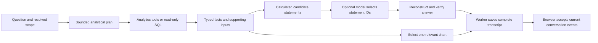

# Chatbot reliability implementation

Scope: chatbot accuracy, one relevant chart, responsive conversation state, and a
testable harness. Follow CLAUDE.md: dataclass contracts, pure transformations,
small adapters, explicit pipelines, and dependencies passed at the edges.

## Work sequence

1. Build a fact-backed answer contract and regression cases. A model selects
   supported statements; numerical statements and comparisons are rendered by code.
2. Preserve every evidence set and show actual fact/formula provenance.
3. Select one primary chart from the answer's evidence; remove the duplicate dock
   and peer entry; prevent accidental aggregation of rates and scores.
4. Give jobs and turns stable identities. Save completion independently of the
   visible conversation, reject stale results, and keep progress payloads small.
5. Repair golden trace extraction and add deterministic integration/browser tests.
6. Run focused regression, broader chatbot checks, and live end-to-end checks
   where the configured services are accessible. Record exact limitations.

## Acceptance cases

- Wrong carrier, unit, sign, missing evidence and conflicting values cannot be
  published as validated facts.
- Derived comparisons record their input facts and formula.
- Multiple queries sharing a lens retain all evidence.
- Headline, body, chart and calculation details agree.
- One primary chart; no analysis sidebar or duplicate peer controls.
- A finished answer never disappears between draft and commit.
- Switching/reloading during a run reconnects to the correct job and saved answer.
- Old title/render/job responses cannot replace a newer conversation or turn.
- Chart traces inspect the nested analyst result and actual presented values.

## Implemented design



### Accuracy and response structure

The response-depth regression came from an overly narrow statement library, a
four-statement cap, and treating any reused input fact as a repeated insight.
The writer now supports up to ten distinct statements for analytical questions;
lookups and explicit short answers remain one statement. Sparse model selections
are completed from the ranked, supported candidates. Summaries and drivers can
share evidence without duplicating the same conclusion across lenses.

Product-line growth can now explain the returned comparable total, largest
growth contributor, largest decline and offsets, breadth, premium mix, growth
excluding the largest contributor, and concentration of gross increases.
Contribution and offset points explain their effect on the combined growth rate;
mix points explain the change in a line's weight. The cap is a maximum, not a
quota: sparse evidence must not be padded with invented analysis.
All are deterministic calculations with input references. Totals explicitly
describe the returned cuts; missing periods are not zero-filled, and rates,
scores and peer averages are not added as premium. The SQL and pandas growth
tools name the underlying measure and actual prior year in their supporting
rows, allowing the answer to use those existing inputs without another query.
Partial-year comparisons keep the same cutoff in both periods.

Version 3 passes the same display scope used by the UI pills to both response
writers. A secondary result with partial metadata no longer makes shared filters
reappear. Differing country/product/period values retain their labels; display
scope never adds a filter to a calculation. Carrier premium is introduced as
"Chubb's premium", with the Marsh placement definition in Source & calculation.
Version 1 and 2 records retain their original reconstruction for saved chats.

Scoped comparisons can span separate tool results with the same metric, unit,
lens and non-period dimensions (including any cutoff). Identical observations
are deduplicated before pairing periods. Different scopes/lenses and unscoped
result sets remain separate; conflicting values still fail closed. Each selected
input retains its original source ID, so combining comparisons does not discard
provenance. SQL fallbacks must faithfully carry their actual scope and metric
semantics; this layer cannot prove an upstream query selected the right book.

Regression coverage: `tests/test_answer_insights.py` exercises the Chubb growth
case, SQL/pandas inputs, missing periods, conflicting operands, sparse selection,
duplicate lenses, scope distinctions and record compatibility. Run the browser
host in `tests/e2e/chat_server.py` with a disposable `APP_DB_PATH`, choose the
Chubb growth starter, send, open Source & calculation, and reload. Expect one
carrier headline, eight supporting points, one chart, unchanged filter pills, and
verification that survives the persisted transcript round trip.

`tests/test_answer_response_quality.py` adds both writer adapters, partial scope,
separate SQL-backed tool calls, duplicate results, subject naming, and a captured
version 2 record. Add "split results" to the Chubb browser question to exercise
separate period queries. The September 10 follow-up passed 600 chatbot/analytics/
chart/harness tests, with three live Azure tests skipped for missing credentials.
The isolated browser run verified the split-result answer, its calculation
drawer, one chart, and persistence after refresh. Live model/warehouse behavior
has not been verified by this fixture.

- All four response rails and the analyst writer share one answer pipeline.
  The model chooses statement IDs from an enum; Python owns the numerical text,
  period comparisons, percentage-point differences, and peer gaps. Missing or
  conflicting evidence produces an explicit limitation instead of invented values.
- Facts retain metric, value, unit, scope, calculation, source ID and supporting
  inputs. Multiple queries with the same lens are preserved. Conflicting values
  for the same metric and scope are rejected even across different lenses.
- Headline and commentary render the same selected statements. Independent KPI
  extraction no longer inserts a different set of numbers into the headline.
- Verification reconstructs the sentences and checks the original fact identity,
  formulas and input references. Matching a number somewhere in a result is only
  labelled **Number match only**. Older saved badges are displayed accordingly.
- The calculation drawer shows the inputs used in a derived comparison. A derived
  value does not need to appear literally in the original rows to be validated.
- Analysts select at most one primary chart, ranked by question relevance and
  chartability. Duplicate result sets are removed. Unsafe implicit aggregation,
  including summed percentages, scores or ranks, is rejected.

### Conversation lifecycle and UI

- Removed the analysis dock, its pin action and the duplicate Tools → Custom
  peers entry. The Peers control beside the composer remains.
- Each job has a stable ID and owns an immutable snapshot of its starting
  transcript. Pending state is saved after the registry accepts the job;
  duplicate launches cannot start another checkpoint writer or save another
  pending snapshot.
- Workers finalize and save success, cancellation, errors and clarification
  independently of browser polling. Completion is published after persistence.
  If storage fails, the answer stays visible with an explicit unsaved notice.
- Conversation loads, renders and job events carry a conversation ID and browser
  selection ID. Late events for a different selection are ignored. Sending during
  a pending switch is disabled and guarded on the server so a question cannot be
  appended to the previously visible conversation.
- Polling reads a small cursor and progress payload rather than repeatedly
  transferring the entire transcript. The interval is 500 ms. Users see named
  progress, elapsed time and an immediate conversation-loading indicator.
- Unverified partial model prose is not displayed and then replaced. A complete
  answer is published atomically. Refresh reconnects to a running job; saved
  conversations reload after completion. A server restart reports interruption
  rather than leaving a permanent spinner.
- Deleted chats cannot be recreated by a finishing worker. Stale edits cannot
  overwrite a later job's saved transcript; persistence checks conversation owner.
- Removed asynchronous model-generated conversation titles and blocking starter
  generation from new-chat navigation. Kept the existing `update_title=None`;
  the browser title remained **ICG Virtual Analyst** throughout testing.
- Fresh turns clear old responses, records, charts, SQL and tool evidence.
  Additive retry/error channels use LangGraph `Overwrite`, so retries actually
  reset. Clarification resumes preserve the interrupted turn.

## Code map

| Responsibility | Location |
| --- | --- |
| Fact identity, units, source preservation and conflicts | `core/answers/facts.py` |
| Supported observations and comparison calculations | `core/answers/claims.py` |
| Explicit answer pipeline and record validation | `core/answers/grounded.py` |
| Strict model-selection adapter | `core/answers/writer.py` |
| Shared adapters for graph state and response rails | `core/answers/response_pipeline.py` |
| Honest verification semantics | `core/answers/provenance.py` |
| Plan limits and dependency remapping | `core/analysis/validation.py` |
| One primary chart | `core/agents/analyst/chart_picker.py` |
| Shared new-turn state | `core/state/turn.py` |
| Job registration and worker lifecycle | `ui/jobs.py` |
| Turn assembly and persistence boundary | `ui/chat_turn.py` |
| Scoped browser events and reducers | `ui/chat_navigation.py`, `assets/chat_lifecycle.js` |
| Saved conversation repository | `core/store/conversations.py` |

This follows CLAUDE.md's dataclass contracts, pure transformations, composition,
small adapters and dependency injection. The entry points show the sequence;
model, database and Dash details stay at the edges. No additional agent framework
or abstraction layer was added.

MCP is the data transport boundary. Tools execute governed calculations. Lenses
describe analytical work. Skills supply instructions. The fact/claim contract is
the boundary that determines what can be published. Adding more skills or MCP
layers would not replace that contract. `core/mcp/README.md` now documents the
existing implementation instead of describing an empty future phase.

## Validation — 10 September 2026

The final chatbot regression run covers response generation, actual analytics
tools, provenance, charts, plans, skills, MCP, app shell and conversation state:
**725 passed, 3 skipped**. The skips are the live-model golden checks. The Node
event reducer suite also passed. `git diff --check` reported no whitespace errors.

The complete repository suite was also run: **2,795 passed, 3 skipped, 13 failed,
24 errors**. One failure exposed an outdated chart expectation that combined
growth percentages across years. Its regression now checks that a unique-category
combo renders and the unsafe cross-period combination is rejected. That chart
suite passes on the final code.

The other 12 failures and 24 setup errors occur in Studio/PowerPoint deck export
paths: COM reports `A specified logon session does not exist` / `Operation
unavailable`. The related deck-generation assertion also fails because assembly
cannot complete. These are in unmodified export code and remain unresolved in
this environment. The complete repository suite is therefore **not green**.

### End-to-end coverage

- An integration test runs the real analytics tools against SQLite, builds the
  answer and source record, checks expected figures with independent SQL, saves
  to the conversation repository, reloads and renders the result.
- Browser testing uses the actual Dash application, worker, repository, response
  pipeline and chart renderer with `tests/e2e/chat_server.py`. Model/routing
  decisions and the SQL dataset are fixtures; this is not a live model benchmark.
- Browser cases passed: one chart with matching $150/$50 source data, calculation
  drawer, new chat, switching while another answer finishes, reopening that
  answer, refresh during a slow run, stop/cancellation, clarification/resume,
  error display and recovered Send control. Desktop and 800 px layouts were
  inspected. No browser console errors were observed during these checks.
- Node tests exercise stale load, completion and render rejection, initial
  restoration, atomic rendering and guarded event publication. Python tests
  additionally cover deletion during work, duplicate starts, storage failure,
  stale edits, wrong carrier with the same value, changed formulas and checkpoint
  retry reset.

### Reproduce

With the project's dependencies installed, run:

```powershell
$env:APP_DB_PATH = (Join-Path (Get-Location) 'chatbot-tests.db')
$chatTests = @(rg --files tests | Where-Object {
    $_ -match '^tests\\test_(analytics_tool_path|analyst|answer|chat|output_directives|chart|mcp|hitl|app_shell)'
})
python -m pytest @chatTests tests/test_grounded_chat.py tests/analytics tests/charts tests/golden tests/skills -q -rs
node --test tests/chat_lifecycle.test.cjs
```

The local `.venv` Python launcher was broken in this session. Tests used
`.venv-codex/Scripts/python.exe` with `.venv/Lib/site-packages` on `PYTHONPATH`,
and an explicit writable `--basetemp` under the workspace. No package upgrade
or application environment change was needed.

For the browser fixture, set `APP_DB_PATH` to a disposable database and run
`python -m tests.e2e.chat_server`; it listens on `127.0.0.1:8093` by default.
Questions containing `slow`, `failure` or `clarify` exercise those paths. The
fixture is test-only and is never installed into the production graph.

## Remaining limits and next quality work

1. **Live model quality is not yet measured.** This environment has no configured
   Azure OpenAI credentials/deployment, so three live golden tests skip. Run the
   existing golden query suite against the intended small model and a reference
   model before choosing the deployment. Compare correct scope, metric, answer
   completeness, chart meaning, latency, tokens and supported-claim coverage.
2. **Verification means faithful to the executed evidence.** It cannot prove that
   an upstream query selected the intended population, that the warehouse is
   correct, or that a metric definition is correct. Strengthen scope/denominator
   contract checks and independent expected-result fixtures for business queries.
   The guarded SQL fallback still exists.
3. **Supported prose is deliberately bounded.** The current library covers
   observations, period changes and peer gaps. It does not invent causal drivers
   or strategic recommendations from correlations. Extend this library with
   tested contribution, coverage and ranking statements; nonnumeric-only results
   currently produce an explicit numeric-evidence limitation. Live evaluation
   must judge usefulness as well as factual consistency.
4. **The job registry is still process-local.** Shared queues, durable job status,
   bounded job retention and distributed ownership are needed before multiple
   web workers or horizontal scaling. Cancellation remains cooperative at graph
   boundaries. A refresh is supported; automatic recovery of a killed worker is
   not implemented.
5. **Chart rejection is intentional when the evidence is insufficient.** A rate
   that needs weighted aggregation should be computed from its denominator by a
   tool. A chart is omitted when it cannot be drawn faithfully. Broader chart
   usefulness still needs the live golden questions.

Changes are local and uncommitted. Unrelated user files and Studio implementation
were preserved. Temporary browser servers and disposable test databases are
cleaned up after verification.
